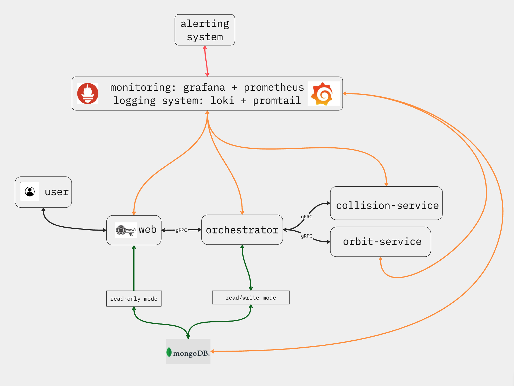

<strong>English</strong>

# StellarTracker

**Track. Analyze. Alert.**

StellarTracker is a microservice-based system for tracking and analyzing orbital objects (asteroids, satellites) with real-time risk assessment and monitoring.

**Key technologies:**
- **Python (Flask, gRPC):** Web interface, API, microservices communication
- **MongoDB:** Data storage for users, objects, observations
- **Orekit (Java via JPype):** Precise orbit determination
- **Prometheus & Grafana:** Monitoring, metrics, dashboards
- **Docker Compose:** Deployment and service orchestration
- **Telegram Bot:** User notifications and quick status access

See [README.systemoverview.md](README.systemoverview.md) for detailed architecture.

<strong>Русский</strong>

# StellarTracker

**Отслеживай. Анализируй. Предупреждай.**

StellarTracker — микросервисная система для отслеживания и анализа орбитальных объектов (астероиды, спутники) с оценкой рисков и мониторингом в реальном времени.

**Основные технологии:**
- **Python (Flask, gRPC):** Веб-интерфейс, API, взаимодействие микросервисов
- **MongoDB:** Хранение данных пользователей, объектов и наблюдений
- **Orekit (Java через JPype):** Точное определение орбит
- **Prometheus и Grafana:** Мониторинг, метрики, дашборды
- **Docker Compose:** Развёртывание и управление сервисами
- **Telegram-бот:** Оповещения и быстрый доступ к статусу

Подробнее об архитектуре — в [README.systemoverview.md](README.systemoverview.md).

