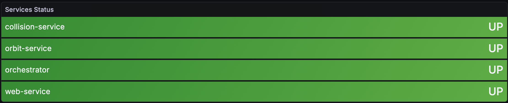
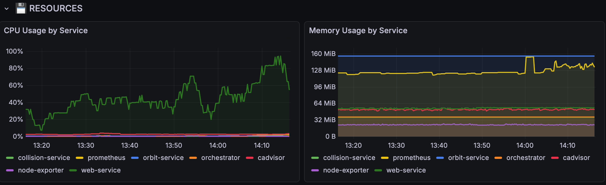
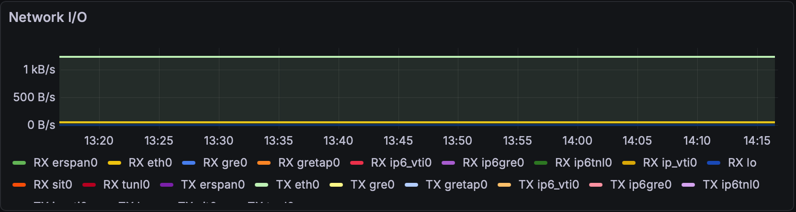
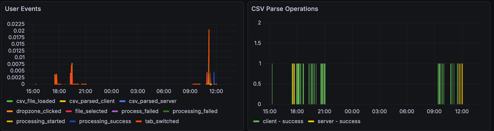

# Обзор системы мониторинга StellarTracker

Система мониторинга StellarTracker позволяет отслеживать состояние всех сервисов, собирать метрики, логи и своевременно реагировать на сбои. В основе лежат Prometheus, Grafana, Loki и другие современные инструменты.

---

## Статус сервисов

Дашборд отображает текущее состояние всех основных микросервисов системы (web, orchestrator, orbit-service, collision-service). Если сервис работает корректно, его статус — **UP** (зелёный индикатор).

---

## Использование ресурсов

Графики показывают загрузку CPU и использование памяти каждым сервисом в системе. Это позволяет быстро выявлять "узкие места" и контролировать нагрузку на инфраструктуру.

---

## Активность пользователей

Данный раздел дашборда отображает основные пользовательские события (например, загрузка и парсинг CSV, запуск обработки, переключение вкладок) и операции парсинга CSV на клиенте и сервере. Это помогает анализировать поведение пользователей и выявлять возможные проблемы с загрузкой данных.

---

# StellarTracker Monitoring System Overview

The StellarTracker monitoring system enables tracking the status of all services, collecting metrics and logs, and responding promptly to failures. It is based on Prometheus, Grafana, Loki, and other modern tools.

---

## Service Status

The dashboard displays the current status of all main microservices in the system (web, orchestrator, orbit-service, collision-service). If a service is operating correctly, its status is **UP** (green indicator).

---

## Resource Usage

Charts show CPU load and memory usage for each service in the system. This allows you to quickly identify bottlenecks and control infrastructure load.

---

## User Activity

This dashboard section displays key user events (such as CSV upload and parsing, processing start, tab switching) and CSV parsing operations on the client and server. This helps analyze user behavior and identify possible issues with data uploads.

