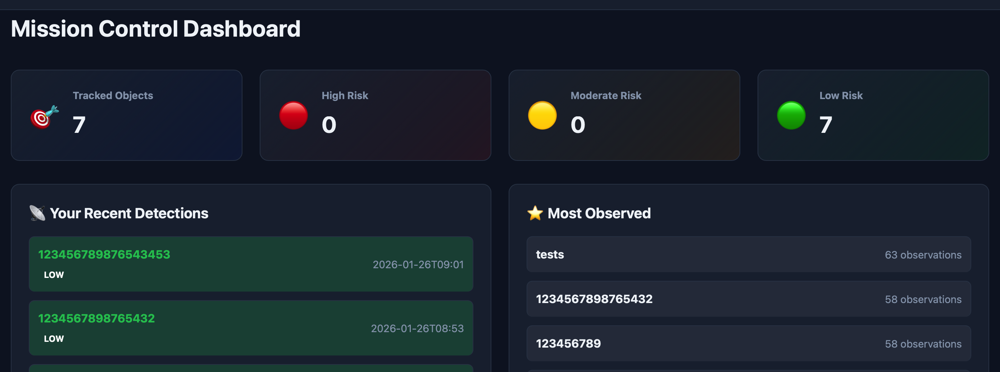

# Обзор веб-сервиса StellarTracker

Веб-сервис StellarTracker — это центральный компонент пользовательского взаимодействия с системой. Он реализован на базе Flask и обеспечивает удобный интерфейс для загрузки наблюдений, просмотра объектов, мониторинга состояния системы и управления пользователями.

---

## Основные функции

- **Дэшборд (Dashboard):**  
  Отображает ключевые метрики системы, количество отслеживаемых объектов, распределение по уровням риска, последние и популярные объекты, а также статистику обработки.

- **Загрузка наблюдений (Upload):**  
  Позволяет пользователям добавлять новые наблюдения вручную или через загрузку CSV-файлов. Поддерживается предпросмотр данных, автоматическая валидация и отправка на обработку.

---

## Архитектура и взаимодействие

- **Flask + Jinja2:**  
  Серверная часть реализует маршруты для HTML-страниц и REST API. Используются шаблоны Jinja2 для генерации страниц.

- **MongoDB:**  
  Хранение пользователей, объектов, наблюдений и истории обработки. Все операции с данными реализованы через отдельный слой моделей.

- **gRPC-клиенты:**  
  Для расчёта орбит и оценки риска веб-сервис взаимодействует с микросервисами Orchestrator, Orbit Service и Collision Service по gRPC.

- **Prometheus:**  
  Веб-сервис экспортирует бизнес-метрики (количество объектов, успешные обработки, ошибки и др.) для мониторинга.

- **Docker:**  
  Веб-сервис развёртывается в отдельном контейнере, поддерживает переменные окружения для гибкой настройки.

---

## Основные модули и файлы

- `web/app.py` — точка входа, инициализация Flask, регистрация blueprints, логирование.
- `web/routes.py` — обработка HTML-страниц (dashboard, upload, objects, monitoring).
- `web/api.py` — REST API для обработки наблюдений, расчёта орбит, оценки риска, парсинга CSV, метрик.
- `web/database.py` — модели пользователей, объектов, наблюдений, истории обработки (MongoDB).
- `web/config.py` — конфигурация приложения (секреты, адреса сервисов, лимиты).
- `web/cli.py` — утилиты для управления пользователями и данными из консоли.
- `web/templates/` — шаблоны Jinja2 для всех страниц.
- `web/static/` — статические файлы (JS, CSS, изображения).

---

## Взаимодействие с другими сервисами

- **Orchestrator:**  
  Принимает наблюдения от пользователя, координирует расчёт орбиты и оценку риска, возвращает результат на веб-интерфейс.

- **Orbit Service:**  
  Вычисляет орбитальные элементы по наблюдениям (вызывается через Orchestrator).

- **Collision Service:**  
  Оценивает риск столкновения по орбитальным элементам (вызывается через Orchestrator).

- **Prometheus/Grafana:**  
  Метрики веб-сервиса доступны для мониторинга и визуализации.

---

## Безопасность и доступ

- **Аутентификация:**  
  Доступ к основным функциям (загрузка, просмотр объектов, мониторинг) возможен только для зарегистрированных пользователей.
- **Роли:**  
  Поддержка ролей пользователей (например, администратор) для расширенного управления.

---

## Пример пользовательских сценариев

**Загрузка новых наблюдений:**  
Пользователь входит в систему, переходит на страницу Upload, добавляет наблюдения вручную или через CSV, отправляет на обработку и получает результат (орбита, уровень риска).

---

## Дополнительная информация

- Подробности по запуску и настройке — в [README.start.md](../README.start.md)
- Описание архитектуры всей системы — в [README.systemoverview.md](../about/README.systemoverview.md)
- Мониторинг и метрики — в [README.monitoring.md](../README.monitoring.md)

---

# StellarTracker Web Service Overview

The StellarTracker web service is the central component for user interaction with the system. It is built with Flask and provides a convenient interface for uploading observations, viewing objects, monitoring system status, and managing users.

---

## Main Features

- **Dashboard:**  
  Displays key system metrics, the number of tracked objects, risk distribution, recent and popular objects, and processing statistics.

- **Upload Observations:**  
  Allows users to add new observations manually or via CSV upload. Data preview, automatic validation, and submission for processing are supported.

---

## Architecture and Interactions

- **Flask + Jinja2:**  
  The backend implements routes for HTML pages and REST APIs. Jinja2 templates are used for page generation.

- **MongoDB:**  
  Stores users, objects, observations, and processing history. All data operations are implemented through a separate model layer.

- **gRPC Clients:**  
  For orbit calculation and risk assessment, the web service interacts with the Orchestrator, Orbit Service, and Collision Service via gRPC.

- **Prometheus:**  
  The web service exports business metrics (object count, successful processing, errors, etc.) for monitoring.

- **Docker:**  
  The web service is deployed in a separate container and supports environment variables for flexible configuration.

---

## Main Modules and Files

- `web/app.py` — entry point, Flask initialization, blueprint registration, logging.
- `web/routes.py` — handles HTML pages (dashboard, upload, objects, monitoring).
- `web/api.py` — REST API for observation processing, orbit calculation, risk assessment, CSV parsing, and metrics.
- `web/database.py` — models for users, objects, observations, and processing history (MongoDB).
- `web/config.py` — application configuration (secrets, service addresses, limits).
- `web/cli.py` — CLI utilities for user and data management.
- `web/templates/` — Jinja2 templates for all pages.
- `web/static/` — static files (JS, CSS, images).

---

## Integration with Other Services

- **Orchestrator:**  
  Receives observations from the user, coordinates orbit calculation and risk assessment, and returns the result to the web interface.

- **Orbit Service:**  
  Calculates orbital elements from observations (called via the Orchestrator).

- **Collision Service:**  
  Assesses collision risk based on orbital elements (called via the Orchestrator).

- **Prometheus/Grafana:**  
  Web service metrics are available for monitoring and visualization.

---

## Security and Access

- **Authentication:**  
  Access to main features (upload, object catalog, monitoring) is available only to registered users.
- **Roles:**  
  User roles (e.g., administrator) are supported for advanced management.

---

## Example User Scenario

**Uploading New Observations:**  
The user logs in, goes to the Upload page, adds observations manually or via CSV, submits for processing, and receives the result (orbit, risk level).

---

## Additional Information

- For details on launch and configuration, see [README.start.md](../README.start.md)
- For overall system architecture, see [README.systemoverview.md](../about/README.systemoverview.md)
- For monitoring and metrics, see [README.monitoring.md](../README.monitoring.md)

